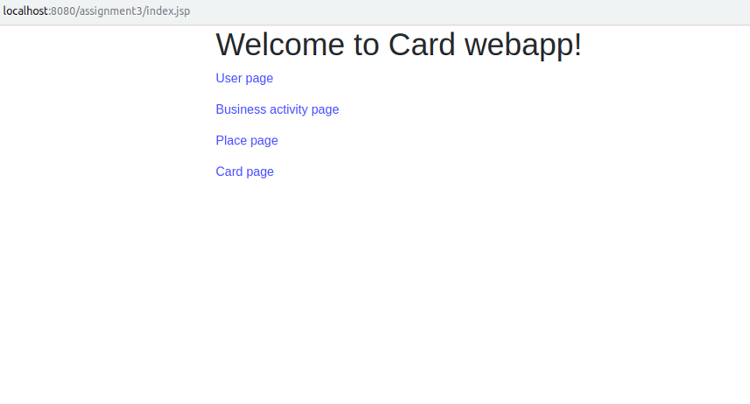
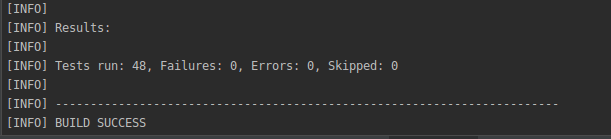

# ASSIGNMENT 3 - Let's Card Webapp

## Members:
+ Avogadro Roberto 807387
+ Belotti Federico 808708    
+ Carta Costantino 808417
    
## Project Repository and import information
+ Gitlab repository link: `https://gitlab.com/belerico/prosviso_assignment_3`
+ The project was developed using `Intellij IDEA`, you can directly import project from gitlab on IntelliJ.
+ Download IntelliJ --> `https://www.jetbrains.com/idea/`
+ On intelliJ --> ``File/new/Project from version control/git``
    + Insert the link of the gitlab repo.

# Environment setup

+ Tested using openjdk version `11.0.1 2018-10-16`

+ Operating systems: `Ubuntu v.18.10` and `Ubuntu v.16.04` 

## MySQL docker image

+ Download docker link:
    + https://docs.docker.com/install/linux/docker-ce/ubuntu/

### Database Login (not needed if using the docker image)

+ The program will look for a db instance on `mysql://localhost:3306` running with a db within it called `assignment3`.
+ If there is not any db called `assignment3` it will be automatically created
+ Login command: `mysql -u root -p`
+ DB access parameters:
    + username: root
    + password: root
+ N.B: you can change configurations in file `src/main/resources/META-INF/persistence.xml`

### Apache Maven plugin

+ Install maven : 
    + `sudo apt install maven`

## Run the webapp
+ Clone the repo locally
    + `git clone https://gitlab.com/belerico/prosviso_assignment_3.git`

+ Move to prosviso_assignment_3 directory

+ Run docker with MySQL v.8 image
    + `docker-compose up -d`

+ Install the project
    + `mvn clean install`

+ Compile the project
    + `mvn compile`

+ Run jetty server
    + `mvn jetty:run`

+ After running previous commands open a browser and type:
    + `http://localhost:8080/assignment3/index.jsp`

+ You'll be redirected to the index page of the webapp

## Test cases

We have implemented JUnit test cases for testing 'Services' of the application as they abstract *DAOs* who manage *CRUD* operations.
We used faker classes for testing the application as they were useful to generate entry in rapid way:
+ `src/main/java/com.assignment3/utils/faker`.

## Run tests
+ command: `mvn test`

+ Snapshot of the console after running tests

